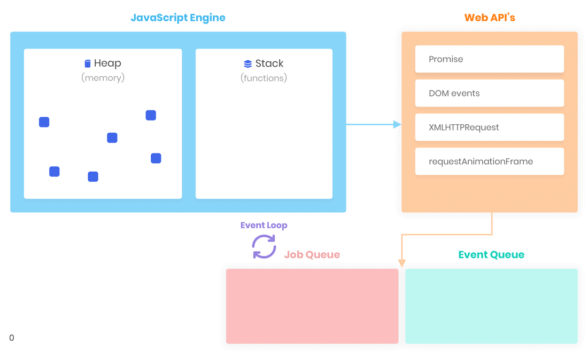

# Como o JavaScript funciona?

O JavaScript é *single thread*, ou seja a execução da aplicação é limitada em somente uma thread.

O JavaScript possui uma área de memória onde armazenamos as informações, essa área é chamad de **Heap** (*Pilhas*).

## Stack

A **Stack** é uma pilha de execução que gerencia as chamadas de funções no decorrer da execução da aplicação, dentro da Stack temos apenas uma linha de execução ativa, por ser single thread o JavaScript não permite executar mais de uma linha ao mesmo tempo.

## Event Queue

Para processar ações assíncronas o JavaScript possui uma outra área chamada **Event Queue** (*Fila de Eventos*), enquanto as funções dentro da **Stack** não terminarem de ser executadas, o JavaScript permanecerá travado, porém quando linha de execução acaba o **Event Queue** é acionado e roda as outras funções que estavam la "agendadas" e pendentes.

## Event Loop

Entre o Event Queue e a Stack existe o **Event Loop**, que tem o papel de monitorar funções na Stack e funções que estão pendentes no Event Queue, por exemplo, supondo que temos um ```setTimeOut()``` registrado no Event Queue, depois das funções da Stack serem finalizadas, o Event Loop jogará a função com ```setTimeOut()``` para a Stack e executá-la na sequência.



> Concluindo, quando falamos que o **JavaScript** é *Single Thread* é porque na **Stack** ele só pode ter apenas uma linha de execução apesar dele possuir um **Event Queue** que registra tarefas pendentes à serem executadas.

> Esse conceito funciona tanto para o Browser quanto para o Node.js

> O ideal é que funções na **Stack** sejam resolvidas o mais rápido possível, enquanto outras funções com chamadas à API por exemplo, sejam inseridas no **Event Queue** através de promises, etc.